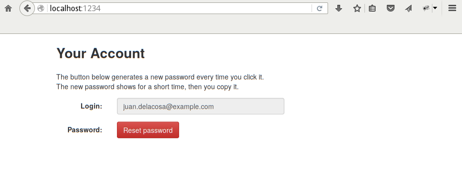
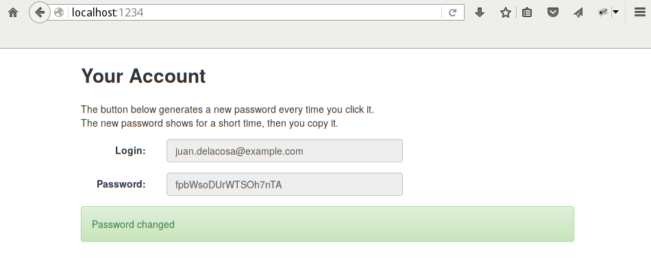
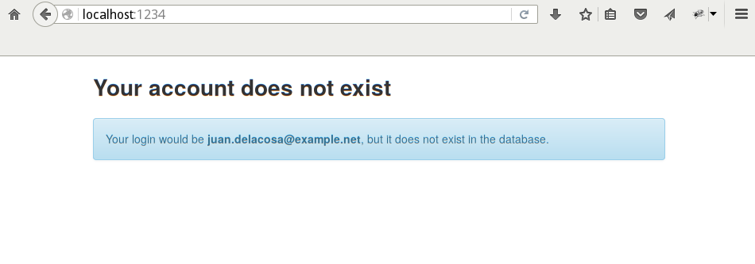

Juan de la Cosa
===============

HTTP server for managing [MariaDB](http://mariadb.org/) users.
Designed to work behind [Sproxy](https://github.com/zalora/sproxy)
and assuming users' logins are their email addresses
(MariaDB allows up to 80 characters).

Currently it only let users get new passwords.

Requirements
============
Juan de la Cosa is written in Haskell with [GHC](http://www.haskell.org/ghc/).
All required Haskell libraries are listed in [juandelacosa.cabal](juandelacosa.cabal).
Use [cabal-install](http://www.haskell.org/haskellwiki/Cabal-Install)
to fetch and build all pre-requisites automatically.

Installation
============
    $ git clone https://github.com/zalora/juandelacosa.git
    $ cd juandelacosa
    $ cabal install

Usage
=====
Type `juandelacosa --help` to see usage summary:

    Usage:
      juandelacosa [options]

    Options:
      -f, --file=MYCNF         Read this MySQL client config file
      -g, --group=GROUP        Read this options group in the above file [default: client]

      -d, --datadir=DIR        Data directory including static files [default: <cabal data dir>]

      -s, --socket=SOCK        Listen on this UNIX-socket [default: /tmp/juandelacosa.sock]
      -p, --port=PORT          Instead of UNIX-socket, listen on this TCP port (localhost)

      -h, --help               Show this message


Database Privileges
===================

```sql
CREATE USER IF NOT EXISTS 'juandelacosa'@'localhost' IDENTIFIED VIA unix_socket;
REVOKE ALL, GRANT OPTION FROM 'juandelacosa'@'localhost';
GRANT UPDATE ON `mysql`.* TO 'juandelacosa'@'localhost';
GRANT SELECT ON `mysql`.`user` TO 'juandelacosa'@'localhost';
```

Screenshots
===========




